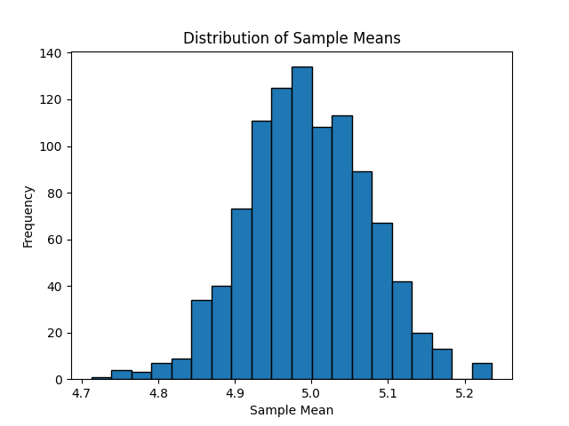
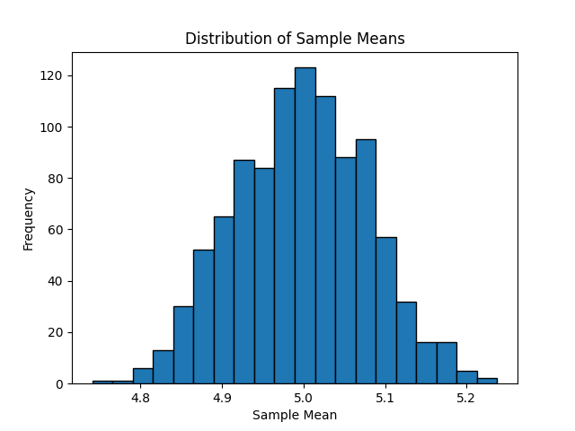
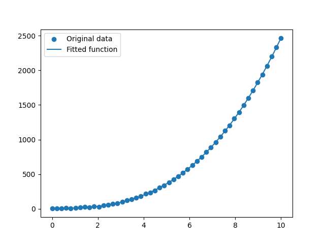
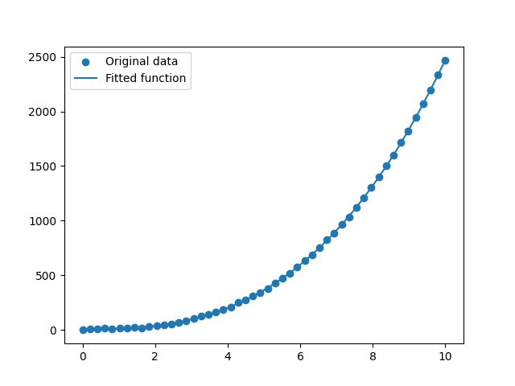

# Sensors and Sensing course S23

# Homework 1

## Task 1.1
Check the Central Limit Theorem by
- building two-modal distribution generating many points,
- taking samples (e.g. 100 values) and computing mean value,
- plotting distribution with mean values from many samples

### Answer for task 1.1
Code task1.py generates a two-modal distribution by combining two normal distributions with different means (0 and 10). The mean of 1000 samples of 150 points each is then calculated and plotted in a histogram. As the number of samples increases, the distribution of sample means approaches a normal distribution, demonstrating the Central Limit Theorem.

I run task1.py 3 times and generated 3 output distributions:

As we can see from the histogram, the distribution of the sample means approaches a normal distribution, which is exactly what the Central Limit Theorem states. This histogram supports the claim that the sample means follow a normal distribution, regardless of the distribution of the original two-modal distribution.

This demonstrates the power of the Central Limit Theorem, which states that the distribution of the sum (or average) of a large number of independent random variables approaches a normal distribution, regardless of the shape of the original distribution.

## Task 1.2

Apply polynomial or nonlinear regression for data analysis by
- generating noisy data points (with nonlinear relationship, i.e. mix a model points + noise points),
- using least square regression or pseudoinverse or optimize.curve_fit methods (on your choice)

### Answer for task 1.2

Code task2.py generate noisy data points and apply polynomial regression using the curve_fit function from the scipy.optimize module:

The curve_fit function optimizes the parameters of the given polynomial function to minimize the mean squared error between the function and the data points. The optimized parameters are then used to plot the fitted function over the original data.

Also, I generated it 3 times:

The linspace function was used to generate 50 equally spaced values between 0 and 10 as the x-values. The y-values were calculated using a polynomial equation 2 * x^3 + 5 * x^2 - 4 * x + 8, with additional random noise added using np.random.normal(0, 4, 50).

The curve_fit function minimizes the mean squared error between the function and the data points, and returns the optimized parameters and the covariance matrix.

The plot shows that the fitted function closely follows the original data, indicating that the polynomial regression was successful in capturing the nonlinear relationship between the x and y values.

In this task, we successfully generated noisy data points with a nonlinear relationship and applied polynomial regression to fit the data. The curve_fit function from the scipy.optimize module was used to minimize the mean squared error between the data and the polynomial function. The results show that the polynomial regression was able to capture the nonlinear relationship between the x and y values.
